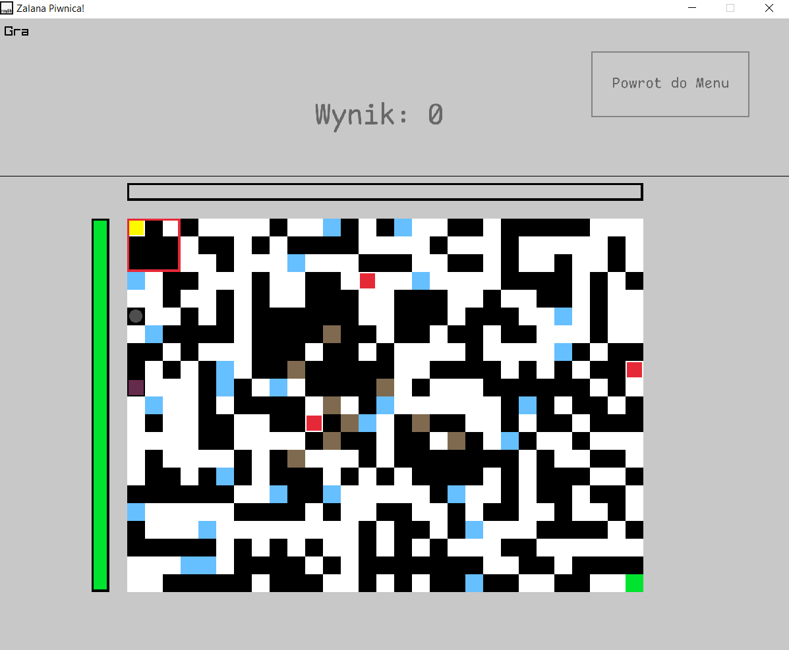
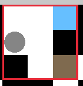

# Cpp_project_flooded_basment
A simple cpp game for a uni cpp course

# Escape through the endless basement!
Your goal is to reach the highest level by navigating through the flooded basement  turning the surrounding walls to to the green finish tile.

# Tutorial

## Player

The **player** is represented by the yellow square, and is moved by the arrow keys. 

## Turntable

The red 3x3 outline is the **turntable**. It can be moved using the WASD keys. Its purpose is turning the labirynth around. By using the Q and E keys, the turntable will flip all allowed tiles and entities inside the outline around by 90 degrees, respectively counterclockwise/clockwise.

### When game gets harder, the turntable will be on a cooldown!

### Moving the player and turning the turntable will cause the entities to update, no matter if the move is succesful or not!

## Infrastructre

### White tiles 

Empty spaces, where the player and rats can move to, and the water can spread.

### Black tiles

Your normal walls.

### Brown tiles

These are the **load-bearing columns**. The turntable cannot be turned if there is one inside the outline (we don't want the ceiling to collapse, do we?). 

### Gray circles

These are the water **drains**. When covered by water, upon the water update, it drains *all* water from surrounding tiles in the 5x5 square around the drain.

## What will kill you

### Water

The blue tiles inside the labirynth represent the titular *flooding* in the basement. After a number of player moves, indicated by the white progress bar above the labirynth, it spreads to all empty tiles in the cardinal directions.

### Ghost of *Yomama Yomama*

A ghost of an old lady, endlessly wandering the basement back and forth, represented by the translucent pink tile.

Only one can spawn per labirynth.

### *Harold(s), the rabid rat(s)*

Rumored to be a failed test subject from the SCP-3008, Harold is the square-shaped red rodent.
Every turn, he has a chance to move, and in it: 
- 80% chance to move in one of the cardinal directions
- 20% chance to move towards the player, in a cardinal direction

If Harold encounters a wall upon moving, he can dig and burrow under the walls to the closest avaliable non-wall tile in that direction.

# How to run the game
The game is prepared fo usage/editing in the VSCode, I have no idea how to exactly run it in any other editor.

Credits to educ8s for the [raylib VSCode template](https://github.com/educ8s/Raylib-CPP-Starter-Template-for-VSCODE-V2).

ComicMono font by [dtinth](https://dtinth.github.io/comic-mono-font/)

1. Make sure to have [raylib](https://www.raylib.com/index.html) and [raygui](https://www.youtube.com/watch?v=c7FAQYImXMk&list=LL&index=2) properly installed.

2. Open the project folder in VSCode.
3. With the `main.cpp` file opened, press the `F5` key to run the game!
4. Enjoy? 

